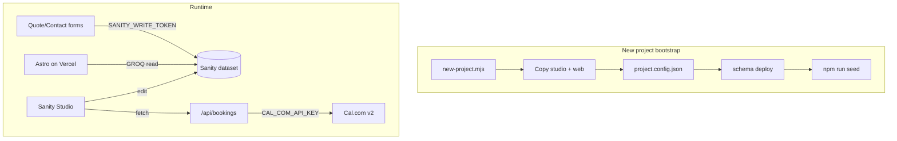

# Project setup flow — Sanity + Astro stack

This repo is a **reusable starter** for bilingual marketing sites: Sanity Studio for content, Astro for the frontend, Vercel for hosting.

```
ftiaxesite/
├── project.config.json       ← per-client settings (site name, URLs, Sanity IDs)
├── project.config.template.json
├── package.json              ← root scripts (new-project, seed, dev)
├── scripts/
│   └── new-project.mjs       ← bootstrap a new client from this template
├── studio-ftiaxesite/        ← Sanity Studio (copy this for new projects)
└── web/                      ← Astro site (copy this for new projects)
```

## What you get out of the box

| Feature | Studio | Web |
|---------|--------|-----|
| 8 singleton pages (home, services, quote, portfolio, about, blog index, contact, settings) | ✓ | ✓ |
| Case studies + blog posts | ✓ | ✓ |
| Bilingual content (el/en) | ✓ | ✓ |
| SEO fields plugin | ✓ | ✓ |
| Form submissions inbox | ✓ | API write |
| Admin email notifications | — | Resend |
| Cal.com booking button | — | Quote success state |
| Cal.com bookings tab | Bookings tool | `/api/bookings` proxy |
| Auto content seed | `npm run seed` | — |

---

## Flow A — New client project (automated)

### 1. Prerequisites

- Node 20+
- [Sanity CLI logged in](https://www.sanity.io/docs/cli): `npx sanity login`
- A **new Sanity project** at [sanity.io/manage](https://www.sanity.io/manage) (note the project ID)

### 2. Run the bootstrap script

From this repo root:

```bash
node scripts/new-project.mjs \
  --output ../my-client \
  --domain myclient.gr \
  --studio-host myclient \
  --sanity-project-id YOUR_PROJECT_ID \
  --seed \
  --deploy-studio
```

This will:

1. Copy `studio-ftiaxesite/` → `my-client/studio/`
2. Copy `web/` → `my-client/web/`
3. Write `project.config.json` with client-specific values
4. Replace hardcoded ftiaxesite IDs/URLs in copied files
5. Create `web/.env` with `PUBLIC_SANITY_*` vars
6. `npm install` in both packages
7. Deploy schema to Sanity (`sanity schema deploy`)
8. **Seed all content** (8 page singletons + 4 sample case studies) if `--seed`
9. Deploy Studio if `--deploy-studio`

### 3. Create API tokens

```bash
cd my-client/studio
npx sanity tokens add "web-write" --role=editor --yes -p YOUR_PROJECT_ID
```

Paste the token into `my-client/web/.env` as `SANITY_WRITE_TOKEN`.

Optional: add `RESEND_API_KEY`, `ADMIN_NOTIFICATION_EMAIL`, `CAL_COM_API_KEY`.

### 4. Configure Studio integrations

In `studio/tools/bookingsTool.tsx`, confirm:

```ts
const BOOKINGS_PROXY_URL = 'https://myclient.gr/api/bookings'
```

Update Cal.com link in `web/src/components/BookCallButton.tsx` if the client has a different calendar.

### 5. Deploy web

Push `my-client/web` to Vercel. Set environment variables from `.env.example`:

| Variable | Required |
|----------|----------|
| `SITE_URL` | ✓ |
| `PUBLIC_SANITY_PROJECT_ID` | ✓ |
| `PUBLIC_SANITY_DATASET` | ✓ |
| `SANITY_WRITE_TOKEN` | ✓ (forms) |
| `RESEND_API_KEY` | optional |
| `ADMIN_NOTIFICATION_EMAIL` | optional |
| `CAL_COM_API_KEY` | optional (bookings tab) |
| `SANITY_STUDIO_URL` | optional |

---

## Flow B — Re-seed content on an existing project

When you need to reset or populate content in the current repo:

```bash
# From repo root
npm run seed

# Or from studio folder
cd studio-ftiaxesite
npm run seed
```

Requires `sanity login` (uses your user token via `--with-user-token`).

The seed script reads **`project.config.json`** at the repo root for:

- Site name, contact email, URLs
- Nav/footer link paths (matches Astro routes: `/services/`, `/quote/`, etc.)

### Documents created automatically

| Document | `_id` | Notes |
|----------|-------|-------|
| `siteSettings` | `siteSettings` | Nav, footer, contact |
| `homePage` | `homePage` | Full homepage sections |
| `servicesPage` | `servicesPage` | Service blocks + FAQ |
| `quotePage` | `quotePage` | Pricing reference + process |
| `howWeWorkPage` | `howWeWorkPage` | About page (`/about/`) |
| `portfolioPage` | `portfolioPage` | Portfolio intro |
| `blogIndexPage` | `blogIndexPage` | Blog hero |
| `contactPage` | `contactPage` | Contact copy |
| `caseStudy` × 4 | fixed IDs | 1 live + 3 coming-soon placeholders |

Blog posts are **not** seeded — add those in Studio as needed.

---

## Flow C — Manual copy (without the script)

1. Copy `studio-ftiaxesite/` and `web/` to a new folder
2. Copy `project.config.template.json` → `project.config.json` and fill in values
3. Update `sanity.config.ts`, `sanity.cli.ts`, `astro.config.mjs` project IDs (or use env vars)
4. Update `web/.env` and `web/.env.example`
5. `npm install` in both folders
6. `npx sanity schema deploy --yes` in studio
7. `npm run seed` in studio
8. `npm run deploy` in studio
9. Deploy web to Vercel

---

## Architecture



---

## Customizing for a new client

| What to change | Where |
|----------------|-------|
| Site name, email, URLs | `project.config.json` → re-run seed |
| Sanity project/dataset | `project.config.json` + `web/.env` `PUBLIC_SANITY_*` |
| Studio title | `studio/sanity.config.ts` |
| Design / pages | `web/src/pages/`, Tailwind tokens |
| Form fields | `web/src/components/QuoteForm.astro` + `formSubmission` schema |
| Cal.com calendar | `web/src/components/BookCallButton.tsx` |
| Bookings proxy URL | `studio/tools/bookingsTool.tsx` |
| Email sender domain | `web/src/lib/admin-notification-email.ts` + Resend DNS |

---

## Local development

```bash
# Terminal 1 — Studio
npm run dev:studio    # http://localhost:3333

# Terminal 2 — Web
npm run dev:web       # http://localhost:4321
```

---

## Troubleshooting

| Problem | Fix |
|---------|-----|
| Form submission 500 | Set `SANITY_WRITE_TOKEN` in `web/.env`, restart dev server |
| Env var not read in API routes | Use `getSecret()` from `astro:env/server` (Astro 5) |
| Seed fails | Run `npx sanity login`, ensure `project.config.json` project ID matches studio |
| Bookings tab empty | Deploy web with `CAL_COM_API_KEY`; check `BOOKINGS_PROXY_URL` |
| Nav links 404 | Re-seed — old seed used Greek paths; current seed uses `/services/`, etc. |
